# 🎶 Music Streaming Web App

A dynamic and responsive music streaming web application built with HTML, CSS, JavaScript, and Node.js, utilizing Spotify's API for a seamless user experience. The app allows users to explore, search, and play songs with real-time data integration.

## 🚀 Features

- **Interactive Interface**: Responsive and modern UI for music streaming.
- **Spotify Integration**: Access to Spotify's vast music database.
- **User Authentication**: Secure login and user management with Spotify's OAuth.
- **Real-Time Search**: Search for artists, albums, and tracks with instant feedback.
- **Dynamic Playlists**: Personalized playlists based on user preferences.
- **Music Player**: In-app music player with essential controls (play, pause, skip).

## 🛠️ Technologies Used

- **Frontend**: HTML, CSS, JavaScript
- **Backend**: Node.js, Express
- **API**: Spotify Web API (Client ID and Secret ID for access)
- **Authorization**: OAuth 2.0 (Spotify’s Authorization Code Flow)

# 📸 Image Gallery

Below is a preview of some images used in this project.

## Gallery

| 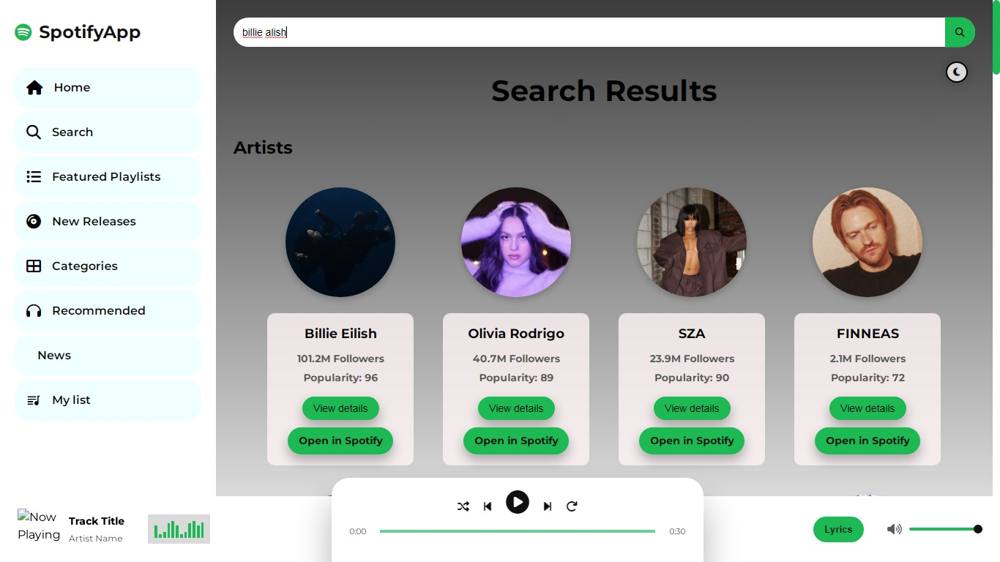 | 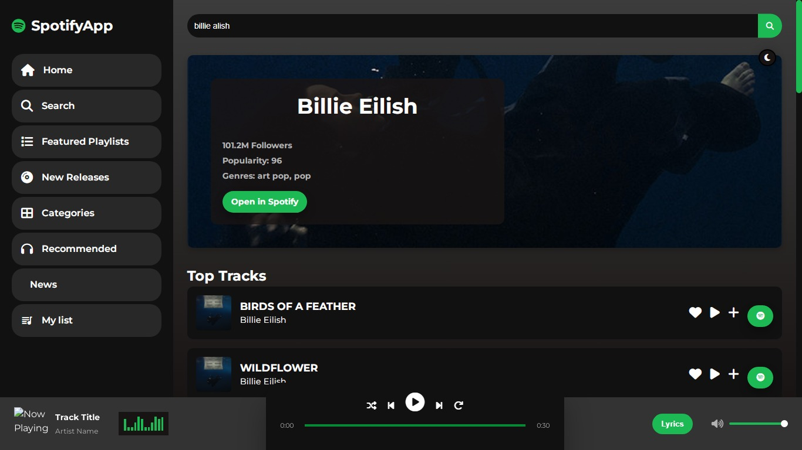 | 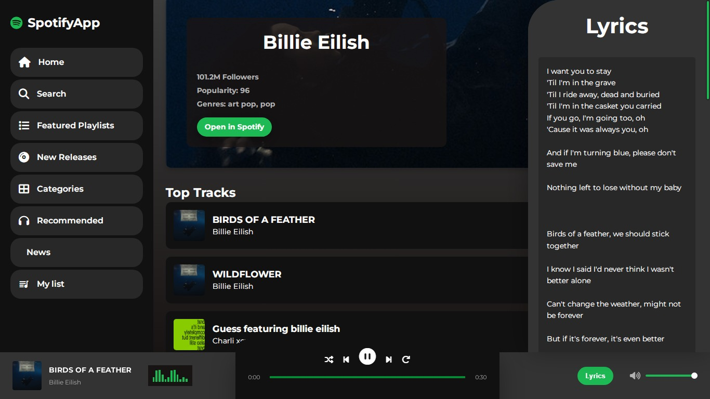 |
|:---------------------------:|:---------------------------:|:---------------------------:|
| Image 1 Description         | Image 2 Description         | Image 3 Description         |

|  | 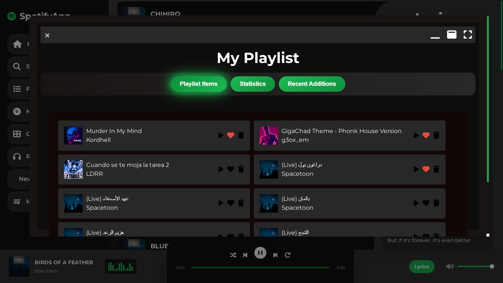 | 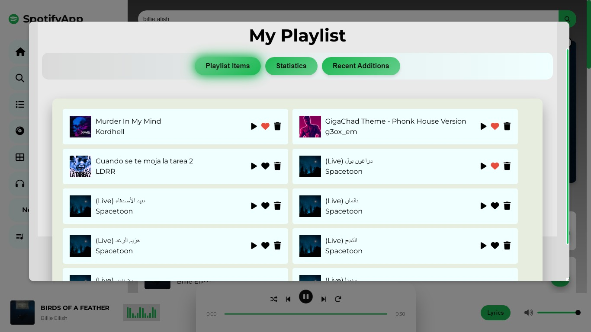 |
|:---------------------------:|:---------------------------:|:---------------------------:|
| Image 4 Description         | Image 5 Description         | Image 6 Description         |

| 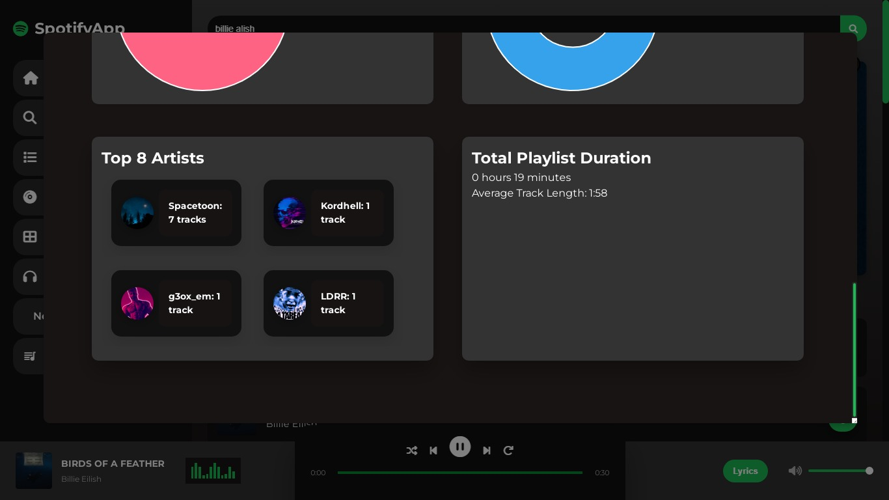 | 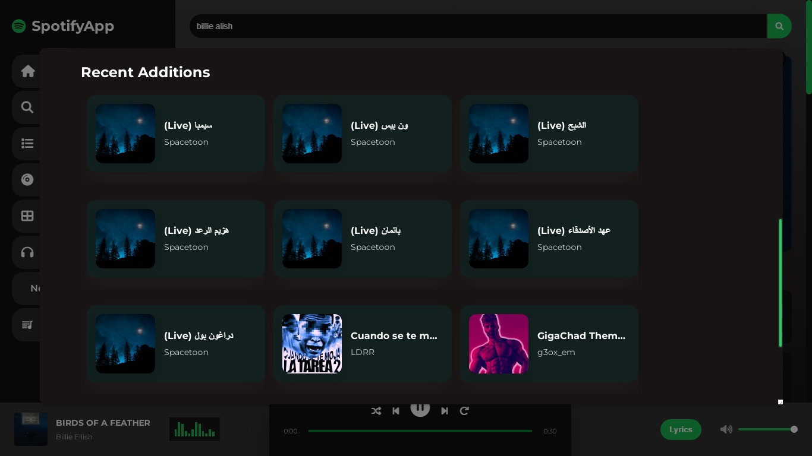 | 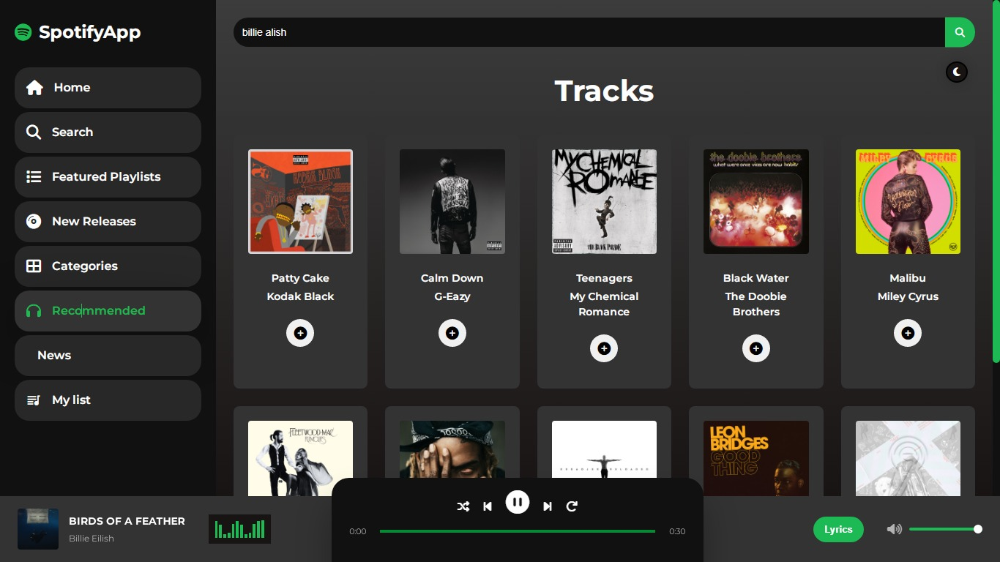 |
|:---------------------------:|:---------------------------:|:---------------------------:|
| Image 7 Description         | Image 8 Description         | Image 9 Description         |

| 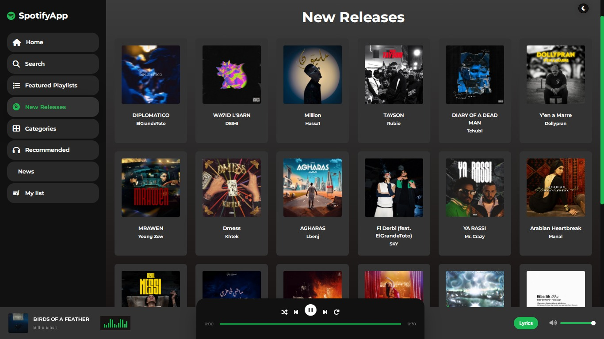 |  |  |
|:---------------------------:|:---------------------------:|:---------------------------:|
| Image 10 Description         | Image 11 Description         | Image 12 Description         |

| 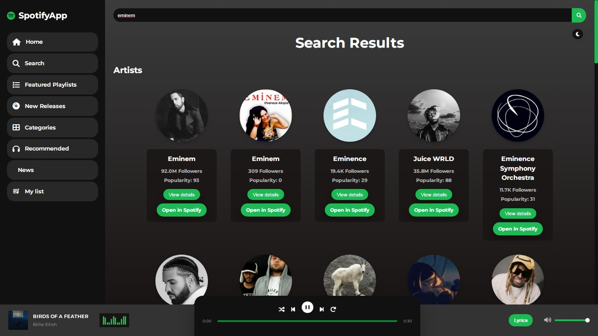 | 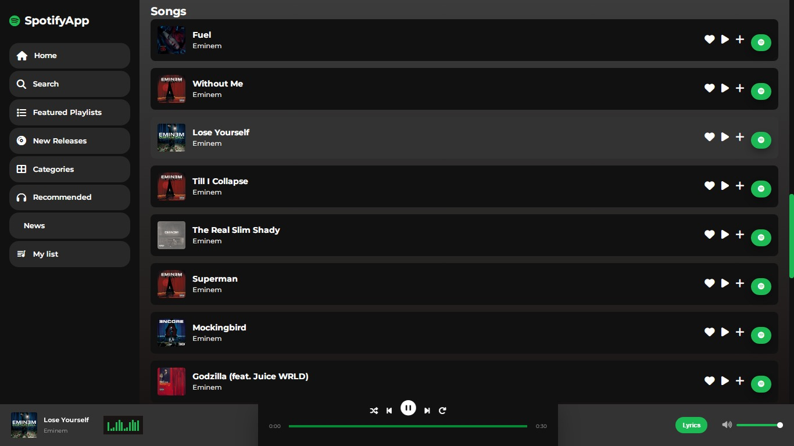 |
|:---------------------------:|:---------------------------:|
| Image 13 Description         | Image 14 Description         |
---

Add or remove images by updating the `src` path and descriptions as needed.

## ⚙️ Installation

1. Clone the repository:
   ```bash
   git clone https://github.com/MEDELBOU3/SM4song.git
   cd music-app
